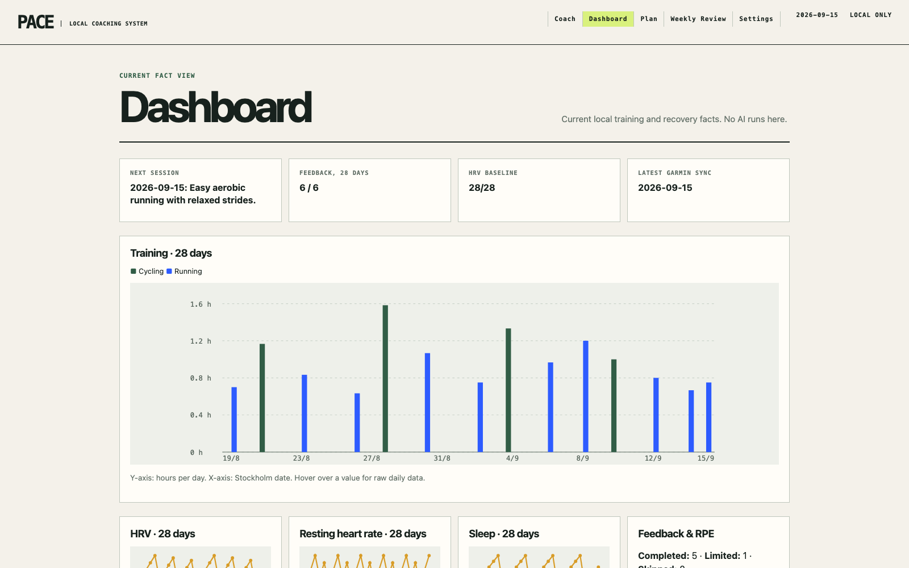

# Pace

**A private, local-first AI coach for running and cycling.**

Pace imports training and recovery data from Garmin Connect, calculates a
reviewable set of facts on your computer, and uses an AI coach for plans,
questions, and weekly reviews only when you ask it to.

> **Status:** early alpha. Pace is useful, but the Garmin integration is
> unofficial and the project has not yet had broad platform testing. The v0.1
> interface and coach output are in English.

## Product preview



This preview uses fully synthetic training and recovery data. No athlete,
Garmin, or OpenAI account data is included. See the
[complete product demo](docs/PRODUCT_DEMO.md) for the active plan, weekly
review, and instructions for running the read-only demo locally.

## Why Pace exists

Most training-plan apps ask you to describe your own fitness. Pace starts with
what you actually did. It separates the system into clear responsibilities:

```text
Garmin Connect
    ↓
local SQLite database
    ↓
deterministic Python facts and validation
    ↓
AI coach proposes and explains
    ↓
you explicitly request or confirm every saved change
```

- **Python owns facts.** Time, distance, frequency, baselines, data quality,
  plan constraints, and validation are calculated in code.
- **You own intent.** You choose sport balance, ambition, availability, races,
  and report how sessions felt.
- **The model owns coaching judgment.** It selects and explains training using
  the supplied evidence. It cannot silently rewrite stored facts or plans.

## What works today

- Guided local setup in the browser
- Garmin login and bounded historical sync
- Running, cycling, HRV, resting-heart-rate, and sleep history
- Athlete context such as illness, pain, travel, and schedule constraints
- Race-aware or general 14-day detailed training plans
- Structured workouts, including intervals and recovery steps
- Session feedback through normal language in the Coach view
- Training dashboard, active plan, and stable weekly review pages
- Personalization from explicit feedback rather than hidden guesswork
- CLI access for diagnostics and reproducible advanced workflows

## Requirements

- macOS (the currently tested platform)
- [uv](https://docs.astral.sh/uv/) for Python and dependencies
- A Garmin Connect account
- Your own OpenAI API key for AI features

Pace currently requires Python 3.14. `uv` can install and manage that Python
version for the project.

On a Mac with Homebrew, install `uv` once:

```bash
brew install uv
```

## Quick start

```bash
git clone https://github.com/viktoreneqvist-hash/Pace.git
cd Pace
uv sync
uv run pace serve
```

The app opens at `http://127.0.0.1:8765`. It is bound to your own computer,
not published to the internet. Keep the terminal window open while Pace runs.

On macOS, you can use Finder after the first clone: double-click
`Start Pace.command` in the repository folder.

The first-run screen guides you through:

1. storing your OpenAI key locally;
2. connecting Garmin, including MFA when required;
3. choosing sport balance, coaching ambition, and available days;
4. entering cycling heart-rate zones when relevant;
5. importing the standard 80-day history window;
6. adding optional races and creating the first plan.

After setup, normal use happens in the browser:

- **Coach** — ask questions and confirm context or session feedback.
- **Dashboard** — inspect current training and recovery facts.
- **Plan** — see the active plan and create the next detailed window.
- **Weekly review** — read the most recently generated weekly review.
- **Races** — add or cancel goals and explicitly choose a race for a new plan.
- **Settings** — change sport role, ambition, availability, cycling zones, and
  run a 7-day or 80-day Garmin sync.
- **Onboarding** — inspect setup status and reopen the secure local setup flow.

Settings, Garmin sync, races, zones, sport balance, and ambition are available
in the browser. The CLI remains available for development and troubleshooting.

The React interface is already packaged with Pace. Normal users do not install
Node.js and do not run a separate frontend server.

### Frontend development

Only contributors changing the interface need Node.js:

```bash
cd frontend
npm install
npm run typecheck
npm run lint
npm run build
```

Production uses the same-origin Python API and real local Pace data. Synthetic
fixtures are opt-in for isolated design work with
`VITE_PACE_USE_MOCKS=true`; they are never the production default.

## Safe commands in the Coach chat

The Coach input also accepts a small allowlist of slash commands:

```text
/help
/today
/state
/analysis
/sync
/review weekly
```

The first four read local facts without calling AI. `/sync` and
`/review weekly` show a confirmation step before an external request. Arbitrary
shell commands can never be executed from the chat box.

## Privacy and data flow

Pace is local-first, not offline-only.

Stored only on your computer:

- the SQLite database in `data/`;
- reusable Garmin session tokens in `.local/`;
- the locally saved OpenAI API key;
- generated HTML reports in `reports/`.

External connections happen only for:

- **Garmin Connect:** login and the syncs you request;
- **OpenAI:** plan generation, coach questions, and weekly reviews you request.

Pace sends OpenAI a bounded catalog of normalized training facts and selected
context. It does **not** send Garmin credentials, Garmin tokens, raw Garmin
payloads, database dumps, or the complete text of private context notes.

The ignored local paths are listed in [`.gitignore`](.gitignore). Do not remove
those rules or upload those directories when reporting a bug.

## Important limitations

- Pace is not affiliated with or endorsed by Garmin. It uses an unofficial
  community library and Garmin may change the underlying service.
- Pace is not medical care and does not diagnose injury or illness.
- The current application is single-athlete and local-only. It has no accounts,
  cloud sync, mobile app, or hosted service.
- Model output can be wrong. Pace validates structure and fact references, but
  you remain responsible for training decisions.
- Cycling power targets and running pace targets require suitable verified
  evidence. Pace falls back to heart-rate zones or RPE when evidence is weak.

## Updating

```bash
git pull
uv sync
uv run pace db init
```

Database migrations preserve existing local data. Back up `data/pace.db`
before testing a pre-release change you do not trust.

## Development

```bash
uv sync
uv run ruff check .
uv run pytest -q
```

The default test suite is synthetic and must not contact Garmin or OpenAI. A
separate live model evaluation exists and costs API usage:

```bash
uv run pace eval scenarios
uv run pace eval coach --live
```

Before contributing, read [CONTRIBUTING.md](CONTRIBUTING.md),
[SECURITY.md](SECURITY.md), [CHANGELOG.md](CHANGELOG.md), and
[AGENTS.md](AGENTS.md). The main design sources
are [Project Vision](docs/PROJECT_VISION.md),
[Architecture](docs/ARCHITECTURE.md), [Decisions](docs/DECISIONS.md), and the
[Roadmap](docs/ROADMAP.md).

## License

Pace is available under the [MIT License](LICENSE).
