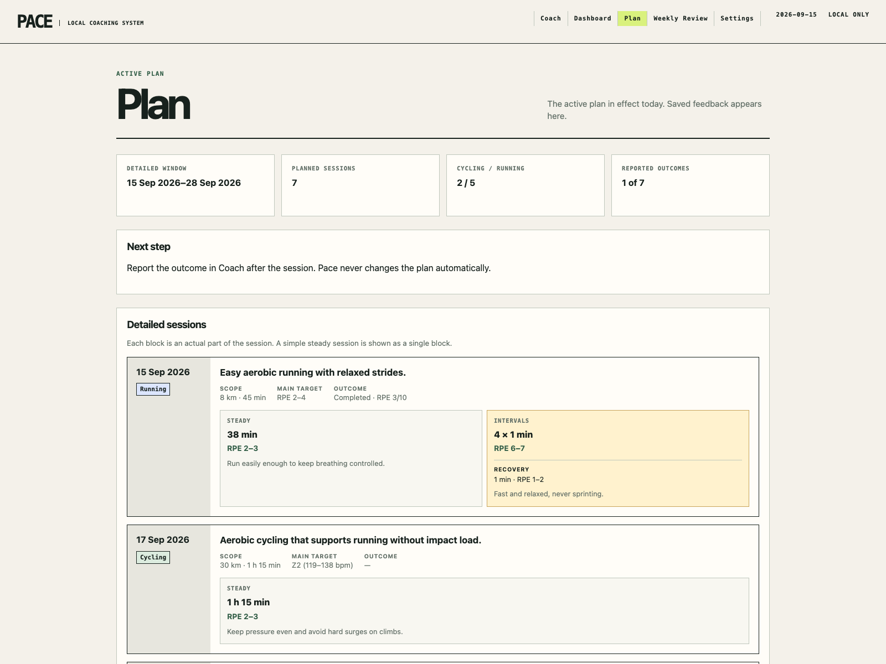
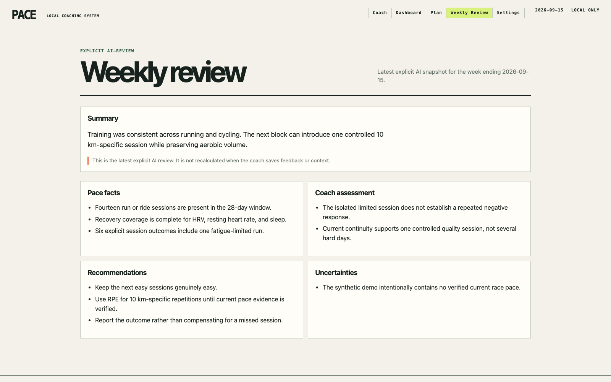

# Pace product demo

These screens show Pace with a fixed, fully synthetic athlete history. The
demo does not read the normal Pace database, Garmin tokens, environment
secrets, or an OpenAI API key. It performs no external requests and all
write actions are disabled.

## Dashboard

The dashboard separates running and cycling, shows 28-day recovery coverage,
and exposes the local facts available to the coach.


## Active plan

The plan view shows the accepted two-week detail window. Simple endurance
sessions remain simple, while structured sessions display their individual
work and recovery blocks.



## Weekly review

The weekly review is an explicit AI snapshot rather than a silently changing
interpretation of old data. This example is a static synthetic fixture.



## Run the demo locally

From the repository directory:

```bash
uv sync
uv run uvicorn demo.app:app --host 127.0.0.1 --port 8877
```

Open `http://127.0.0.1:8877/dashboard` in a browser. Stop the demo with
`Control-C` in the terminal.

The fixed date, sessions, race, recovery values, and feedback live in
`demo/app.py`; the example review lives in `demo/weekly-review.json`.
